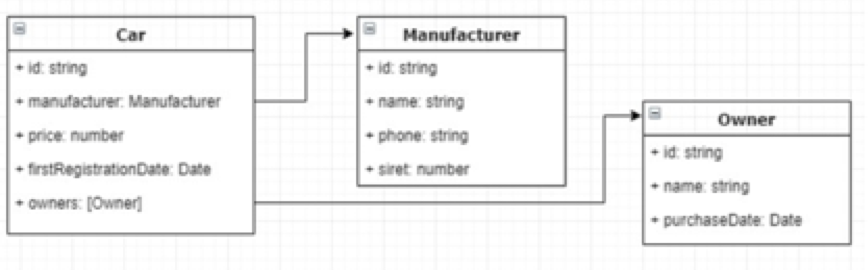

## Description

Coding test
NodeJs/Typescript
This coding exercise consists in implementing a little backend micro-service that aims to serve the car’s data.
This component will expose a REST API providing CRUD operations to fetch one or several cars, create, update and delete a car. Through this API, it will also be possible:

  1. Fetch only the manufacturer data for a given car (without any manufacturers dedicated APIs – i.e. only by using the car API)

  2. To trigger a process that will automatically remove the owners who bought their cars before the last 18 months and apply a discount of 20% to all cars having a date of first registration between 12 and 18 months.

The car data model will be kept relatively simple:



The application has to be configured to run in a Docker container. Tests CI/CD are welcome there.
Moreover, the expected (and mandatory) programming paradigm to respect is the OOP (oriented-object programming).

The language to use will be Typescript and the framework Nestjs. 

Code source will be delivered through the GitHub/Bitbucket/Gitlab

## Instalation

```bash
$ npm install
```

## API

You can use **Insomnia client** to test and work with api. Import data from **Insomnia.json** file to your installed Insomnia client.

To access **Swagger docs** use localhost:2502/api while server is running.

## Tests

To run tests use

```bash
$ npm run test
```

## Build

To run this app you need to have docker-compose and node.js installed and can build app with shell script using command below

```bash
$ sh build.sh
```
